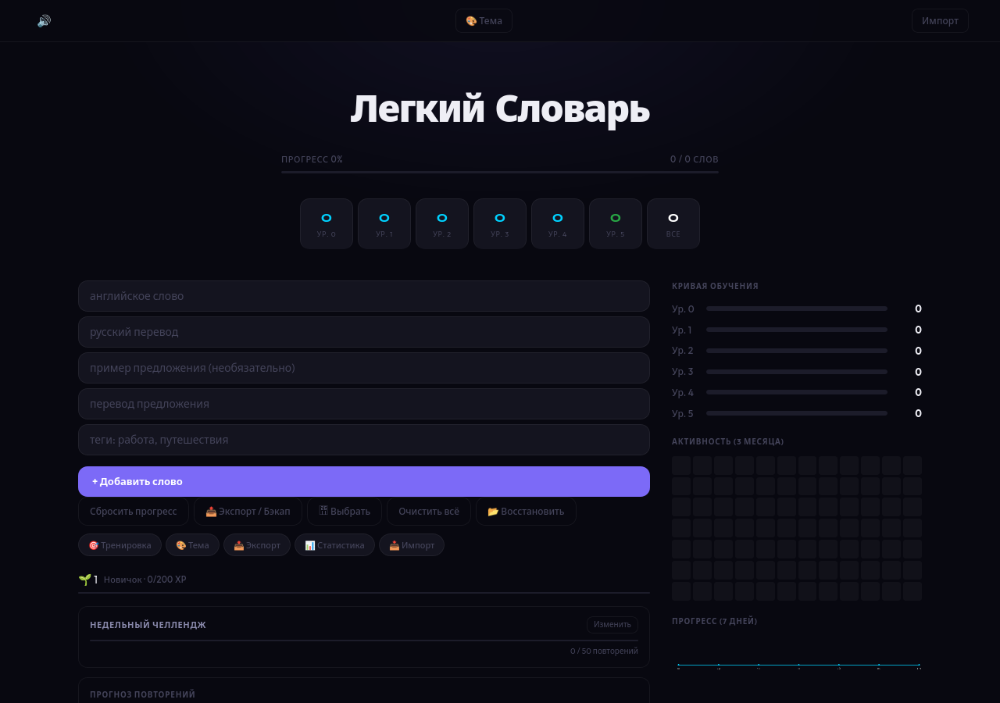

# 📚 Лёгкий Словарь — offline-first English vocabulary trainer

*[Русская версия](README.ru.md)*


[](https://github.com/Whyslab/teach-me-english/actions/workflows/ci.yml)

A self-hosted vocabulary trainer built around spaced repetition. Add an English word, and the app attaches the things that actually make a word stick — a translation, an example sentence, an illustration, and a clip of a real YouTube video where the word is spoken — then schedules reviews so you see it again right before you would have forgotten it.

Installable as a PWA and fully usable with no network connection.

> The interface is in Russian, since it is built for Russian speakers learning English. The codebase and this document are in English.



---

## ✨ What it does

* **Six-level spaced repetition.** Every word carries a `level`, a `nextReview` timestamp and a `forgetStep`. Answer correctly and the interval grows; miss it and the word drops back down and returns sooner.
* **Words in context, not in isolation.** Each entry can hold an example sentence with its translation, an image, and a YouTube fragment — `videoId` plus `startTime`/`endTime` and the subtitle line. Words that have a clip show a 🎬 button; pressing it plays exactly that moment in an embedded player, with the subtitle underneath and the word highlighted in it. Clips are attached offline by the scripts in `tools/` — see [Attaching video clips](#-attaching-video-clips).
* **Example sentences from Tatoeba.** Proxied server-side to work around CORS.
* **Illustrations, looked up once.** Images come from [Openverse](https://openverse.org/) with [Wikimedia Commons](https://commons.wikimedia.org/) as a fallback — no API key needed. The result is cached in the word's `imageUrl`, because Openverse allows only 200 anonymous lookups a day and a word only needs looking up once.
* **Progress you can see.** Learning curve per level, a three-month activity heatmap, a seven-day progress chart, a review forecast, XP and weekly challenges.
* **Works offline.** A service worker caches the shell and assets; the deck lives in the browser and syncs back to the server when it can.
* **Your data stays yours.** Export, backup, restore and import are all built in — the deck is a file you own, not a subscription.
* **Tagging and filtering** by level or by your own tags.

---

## 🛠️ Stack

| Layer | Choice |
|---|---|
| Backend | Node.js + Express 5 |
| Storage | SQLite (WAL mode) via `sqlite3` |
| Frontend | Vanilla JS, no framework |
| Offline | Service worker + Web App Manifest |
| Hardening | `express-rate-limit`, CORS allow-list |
| Tooling | Python scripts for mapping words to video fragments |

---

## 🚀 Running it

Requires Node.js 20.17 or newer — that is what `sqlite3` 6.x needs.

```bash
git clone https://github.com/Whyslab/teach-me-english.git
cd teach-me-english
npm install
npm start
```

Then open <http://localhost:3000>.

`vocab.db` is created automatically on first run — there is no migration step. To install the app properly, open it in a browser and use "Install app" / "Add to Home Screen".

### Configuration

| Variable | Default | Purpose |
|---|---|---|
| `ALLOWED_ORIGINS` | `http://localhost:3000` | Comma-separated CORS allow-list. Set this if you serve the app from another host. |
| `PORT` | `3000` | Port to listen on. |
| `DATABASE_PATH` | `./vocab.db` | Where the deck is stored. Tests point this at a throwaway file. |

> **Note on `npm install`:** `sqlite3` compiles a native binding. Recent npm versions block install scripts by default; if `require('sqlite3')` fails afterwards, run `npm rebuild sqlite3` once.

---

## 🔌 API

| Method | Route | Purpose |
|---|---|---|
| `GET` | `/api/words` | The caller's deck |
| `POST` | `/api/sync` | Push local changes back to the server |
| `POST` | `/api/register` | Create a user id |
| `GET` | `/api/tatoeba?word=…` | Example sentences (CORS proxy) |
| `GET` | `/api/word-image?word=…` | Illustration for a word — cached in the deck after the first lookup |
| `GET`/`POST` | `/api/timer` | Session timer state |

The client sends an `X-User-Id` header, but the server does not read it — this is a single-user application and the id is fixed. `/api/tatoeba` and `/api/word-image` are rate limited to 100 requests per 15 minutes per IP; the rest are not.

> **There is no authentication.** Every route is open to anything that can reach the port. That is fine on `localhost`, and fine on a home network you trust. Do not port-forward this to the internet.

---

## 🗂️ Data model

```sql
words (
    id, original, translate, example, exampleTranslate,
    level, nextReview, forgetStep, tags,
    videoId, startTime, endTime, subtitleText, imageUrl
)
settings (key, value)
```

`level`, `nextReview` and `forgetStep` are the scheduler; the `video*` and `imageUrl` columns are what turn a flashcard into something memorable.

---

## 🧪 Tests

```bash
npm install
npm test
```

42 tests, run against a throwaway SQLite file rather than your real deck.

`tests/api.test.js` covers the API: the validation rules, the sync round-trip, tag normalisation, timer bounds, the image cache, and that the app shell, service worker, manifest and favicon are all served with the right content types.

`tests/client.test.js` covers the pure functions in `app.js` — HTML/attribute/JS-string escaping and the clip URL builder — by extracting the declarations out of the file and running them in isolation. `app.js` is one browser script with no module system, so this is a workaround; it buys real coverage of the escaping without rewriting the frontend first.

CI runs them on Node 20 and 22, plus a static pass that syntax-checks every JavaScript file and asserts every icon the manifest declares actually exists.

---

## 🚀 Running it as a service

The quick start above runs the app in a terminal — close it and the app stops. To have it start with your session and stay up:

```bash
./deploy/install.sh
```

It checks your Node version, installs dependencies, builds the native `sqlite3` binding, creates `.env` from `.env.example` if you have none, generates a systemd **user** unit with the repository's real path substituted in, starts it, and then waits for the app to answer before declaring success. No `sudo` — a user unit lives in your home directory.

```bash
systemctl --user status teach-me-english     # is it up
journalctl --user -u teach-me-english -f     # what is it saying
./deploy/uninstall.sh                        # stop and remove the unit
```

`uninstall.sh` removes the unit and leaves `vocab.db` and `.env` alone — your words are in there.

The unit is sandboxed: `ProtectSystem=strict`, `ProtectHome=read-only`, and a single `ReadWritePaths` pointing at the repository. If you move the repository, re-run `install.sh` so the paths are rewritten.

### Configuration

Copy `.env.example` to `.env` and edit it. Every value has a working default, so an empty `.env` is fine.

| Variable | Default | What it does |
|---|---|---|
| `PORT` | `3000` | Port the server listens on |
| `DATABASE_PATH` | `./vocab.db` | Database file. A relative path is resolved against the application directory, not your shell's working directory |
| `ALLOWED_ORIGINS` | `http://localhost:3000` | Comma-separated origins allowed to call the API. Opening the app from your phone at `http://192.168.1.50:3000` means adding that origin here, or the browser will block every request |

---

## 🎬 Attaching video clips

The 🎬 button appears on a word once that word has a `videoId`. Nothing in the app puts one there — clips are attached offline, by the scripts in `tools/`, run against `vocab.db` while the server is stopped.

```bash
pip install -r tools/requirements-video-mapper.txt

# 1. Find a video for each word that has none yet.
python3 tools/youtube_fragment_mapper.py

# 2. Replace the placeholder timestamps with the real moment the word is
#    said, read out of the video's subtitles.
python3 tools/refine_segments.py
```

`refine_segments.py` is the one to use — it pulls subtitles through `yt-dlp` directly, supports `--cookies-file` and `--proxy-list` for when YouTube starts rate-limiting, and has a `--reprocess-long` mode for clips that came out too long. The other scripts in `tools/` (`check.py`, `trim_segments.py`, `final_test.py`, `debug_sub.py`, `test_sub.py`) are earlier iterations kept for reference; they are not part of the pipeline.

Nothing here downloads video or audio. It reads YouTube's own captions and stores four fields per word.

> If you use `--cookies-file`, that file is a live login to your Google account. It is in `.gitignore` for a reason — never commit it, and never share it.

---

## ⚠️ Known rough edges

* `app.js` is a single ~150 KB file. It works, but splitting it into modules is the main thing this project needs next.
* Frontend coverage is limited to the pure helpers. Rendering and the review flow are not tested.
* `POST /api/sync` replaces the whole `words` table on every call. With one device that is fine. With two, the last one to sync wins and the other device's new words are gone. Incremental merge is the next real feature.
* Clips have to be attached offline by hand — there is no in-app "find me a clip for this word" button.

---

## 📄 License

MIT — see [LICENSE](LICENSE).
