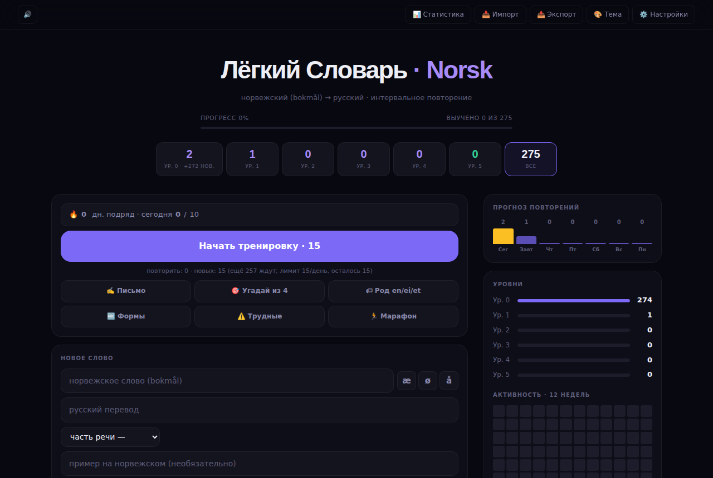

# 🇳🇴 Лёгкий Словарь · Norsk — offline-first Norwegian vocabulary trainer

*[Русская версия](README.ru.md)*


[](https://github.com/Whyslab/teach-me-english/actions/workflows/ci.yml)

A self-hosted trainer for **Norwegian (Bokmål)** vocabulary built around spaced repetition. Add a Norwegian word and the app suggests a translation, pulls example sentences, speaks the word with a Norwegian voice, and schedules reviews so you see it again right before you would have forgotten it.

Installable as a PWA and fully usable with no network connection.

> The interface is in Russian — the app is built for Russian speakers learning Norwegian. The codebase and this document are in English.



---

## ✨ What it does

* **SM-2 spaced repetition** (the Anki algorithm), two grades — *don't remember* (1 / ←) and *remember* (2 / →). Only the first answer of a day moves the schedule; repeats inside a session just relearn the word. Intervals of 3+ days get ±10% fuzz so reviews don't arrive in clumps. Ease, interval, repetitions and answer history are persisted server-side.
* **A daily new-word limit** (15 by default, like Anki). Reviews are never capped, so importing a large deck does not turn into a review avalanche a week later.
* **Main training vs. practice.** The main training (and the marathon) follows the SM-2 schedule and the new-word limit. Every other mode is *practice*: always available, 20 words (due first, then the hardest), and it never moves the schedule.
* **Grammar:** noun gender (`en` / `ei` / `et`, colour-coded) and inflections — *et hus — huset — hus — husene*, *å reise — reiser — reiste — har reist*, *stor — stort — store*. A "⚡ regular forms" button fills in the regular noun and adjective patterns.
* **Training modes:** flashcards (NO→RU, RU→NO or random per card) · writing NO→RU · writing RU→NO · **dictation** · multiple choice · **guess the gender** · **inflection drill** · **cloze** (the word cut out of its example) · hard words · marathon (no limit).
* **Bundled decks:** Norsk A1 (275 words) and Norsk A2 (342 words, no overlap with A1) with gender, forms, examples and Russian translations — one click in the Import dialog (`decks/*.txt`, plain import format). Re-importing a deck fills in missing grammar and examples on words you already have, without touching progress.
* **"❓ How it works"** dialog in the app: word levels 0–5, when a word counts as learned, main training vs. practice.
* **Pronunciation:** a local neural voice via [Piper](https://github.com/OHF-Voice/piper1-gpl) (`no_NO-talesyntese-medium`, installed by `./deploy/install-voice.sh`, synthesized once per word and cached in `tts-cache/`; `GET /api/tts?text=…&rate=…`; a persistent worker process keeps the model loaded, and a speed slider lives in the settings), falling back to browser speech when Piper is absent, plus links to [Forvo](https://forvo.com/languages/no/) (native speakers) and [Ordbøkene](https://ordbokene.no/) (the official Bokmål dictionary).
* **æ ø å buttons**; answers that are right except for the special letters are flagged separately.
* **Auto-translation** Norwegian → Russian (off by default, enable in settings) and **Tatoeba examples** (Bokmål ↔ Russian).
* **Stats:** streak with a daily goal, review forecast, level curve, activity heatmap, hard words, per-word history.
* **Offline PWA**, TXT/CSV/Anki export, JSON backup and restore, **4 themes** (system, dark, light, Nord).

---

## 🛠️ Stack

| Layer | Choice |
|---|---|
| Backend | Node.js + Express 5 |
| Storage | SQLite (WAL mode) via `sqlite3` |
| Frontend | Native ES modules in `js/`, no framework, no bundler |
| Offline | Service worker + Web App Manifest |
| Hardening | Static file allow-list, `express-rate-limit`, CORS allow-list |

---

## 🚀 Running it

Requires Node.js 20.17 or newer — that is what `sqlite3` 6.x needs.

```bash
git clone https://github.com/Whyslab/teach-me-english.git
cd teach-me-english
npm install
npm start
```

Then open <http://localhost:3000>. `vocab.db` is created on first run; older databases are migrated in place.

> **Note on `npm install`:** `sqlite3` compiles a native binding. Recent npm versions block install scripts by default; if `require('sqlite3')` fails afterwards, run `npm rebuild sqlite3` once.

### Import format

One word per line: `word|translation|example|example translation|tags|grammar|forms`. Only the first two fields are required. Grammar is `en`/`ei`/`et` for nouns, `v` for verbs, `a` for adjectives; forms are comma-separated (noun: definite singular, indefinite plural, definite plural; verb: present, past, perfect; adjective: neuter, plural/definite). TXT export writes the same format.

```
hus|дом|Huset er stort.|Дом большой.|A1,hjem|et|huset,hus,husene
å reise|путешествовать||||v|reiser,reiste,har reist
stor|большой|et stort hus|большой дом||a|stort,store
eple|яблоко
```

---

## 🔌 API

| Method | Route | Purpose |
|---|---|---|
| `GET` | `/api/words` | The deck, including SM-2 state and answer history |
| `POST` | `/api/words/batch` | Incremental sync: `{upserts, deletes}` — only changed words |
| `POST` | `/api/sync` | Replace the deck with the client's copy (queued, transactional) |
| `GET` | `/api/state` | Settings and answers per day, shared by all devices |
| `POST` | `/api/state` | `{settings, activity, activityEpoch}` → merged state: newer settings win (`updatedAt`); activity takes the per-day maximum, a newer `activityEpoch` (reset/restore) replaces it, an older one is ignored |
| `GET` | `/api/tts?text=…&rate=…` | Norwegian speech as WAV (Piper), cached in `tts-cache/` |
| `GET` | `/api/tts/status` | Whether Piper is installed and which mode (worker / CLI) is used |
| `GET` | `/api/tatoeba?word=…` | Bokmål → Russian example sentences (CORS proxy) |
| `GET` | `/api/ordbok?w=…` | Part of speech, gender and forms from Ordbøkene (ord.uib.no); `en/ei/et/å` in the query pick the article |
| `POST` | `/api/import/screenshot` | Raw PNG/JPEG/WebP body → OCR (tesseract `nor`) → word cards with grammar and MyMemory translations |

Only the frontend is served statically — `index.html`, `sw.js`, `manifest.json`, icons, and files matching `js/*.js`, `css/*.css`, `decks/*.txt` (flat names only). The database, server sources and deploy scripts are not.

> **There is no authentication.** Every route is open to anything that can reach the port. Fine on `localhost` or a trusted home network; do not port-forward this to the internet.

---

## 🗂️ Data model

```sql
words (
    id, original, translate, example, exampleTranslate,
    level, nextReview, forgetStep, tags,
    sm2EF, sm2Interval, sm2Reps, history, addedAt,
    pos, gender, forms            -- part of speech, en/ei/et, JSON of inflections
)
```

Databases created by the earlier English version carried `videoId`, `startTime`, `endTime`, `subtitleText`, `imageUrl` and a `settings` table for the removed daily timer; the migration drops them. `id` has a unique index (duplicate ids are removed first) so incremental sync can upsert.

---

## 🧪 Tests

```bash
npm install
npm test            # unit and API tests
npm run test:e2e    # browser tests (Playwright + Chromium)
```

`npm test` runs against a throwaway SQLite file. `tests/api.test.js` covers validation, the sync round-trip (SM-2 state, gender and forms), concurrent syncs, the static allow-list including traversal attempts, and the Tatoeba input checks. `tests/client.test.js` imports the DOM-free modules directly — SM-2, session selection with the new-word limit, answer checking (articles, æ ø å, alternative translations), regular-form guessing, the import/export format, the integrity of both decks, grammar enrichment on re-import, incremental sync diffs, the Piper worker protocol and the backup script — and adds static checks on the markup: every `data-action` has a handler, every looked-up id exists, no inline handlers or scripts, and the service worker precaches every module.

`tests/e2e/` drives a real Chromium: only changed words are sent, answers made while the server is down survive a reload, `sendBeacon` on tab close, speech through Piper vs. the browser, practice modes, dictation, cloze, deck re-import.

CI runs the unit tests on Node 20 and 22, the browser tests, plus a static pass that syntax-checks every JavaScript file and asserts every icon the manifest declares exists.

---

## 🚀 Running it as a service

```bash
./deploy/install.sh
```

Checks your Node version, installs dependencies, creates `.env` from `.env.example`, generates a systemd **user** unit (`teach-me-norwegian.service`), starts it and waits for it to answer, and installs a daily backup timer (`teach-me-norwegian-backup.timer`: `VACUUM INTO` a copy under `~/Backups/teach-me-norwegian`, keeps the last 14). No `sudo`. `./deploy/install-voice.sh` installs Piper and the Norwegian voice. If the old `teach-me-english.service` unit is present, it is stopped and archived first so the two do not fight over the port.

```bash
systemctl --user status teach-me-norwegian
journalctl --user -u teach-me-norwegian -f
./deploy/uninstall.sh      # removes the unit, keeps vocab.db and .env
```

### Configuration

| Variable | Default | What it does |
|---|---|---|
| `PORT` | `3000` | Port the server listens on |
| `HOST` | `127.0.0.1` | Interface to bind. `0.0.0.0` to reach it from your phone |
| `DATABASE_PATH` | `./vocab.db` | Database file, resolved against the application directory |
| `ALLOWED_ORIGINS` | `http://localhost:3000` | Comma-separated CORS allow-list |
| `PIPER_BIN` / `PIPER_MODEL` | `.venv-tts/bin/piper`, `voices/no_NO-talesyntese-medium.onnx` | Piper binary and voice |
| `PIPER_WORKER` | `tts_worker.py` under the venv's Python | Persistent worker executable (receives the model path); empty string disables it — one Piper process per phrase |
| `TTS_CACHE_DIR` | `./tts-cache` | Where synthesized WAV files are cached |
| `BACKUP_DIR` / `BACKUP_KEEP` | `~/Backups/teach-me-norwegian`, `14` | Daily backup location and how many copies to keep |

---

## 📋 Project documents

* [docs/AUDIT.md](docs/AUDIT.md) — code audit: what was broken and what was fixed (in Russian).
* [docs/ROADMAP.md](docs/ROADMAP.md) — what to add, remove and optimise next (in Russian).

## ⚠️ Known rough edges

* Two devices editing the same word offline: the last one to sync wins for that word.
* The Tatoeba and MyMemory language codes (`nob`, `nb-NO`) follow the services' documentation but were not verified against the live APIs during the migration.

---

## 📄 License

MIT — see [LICENSE](LICENSE).
